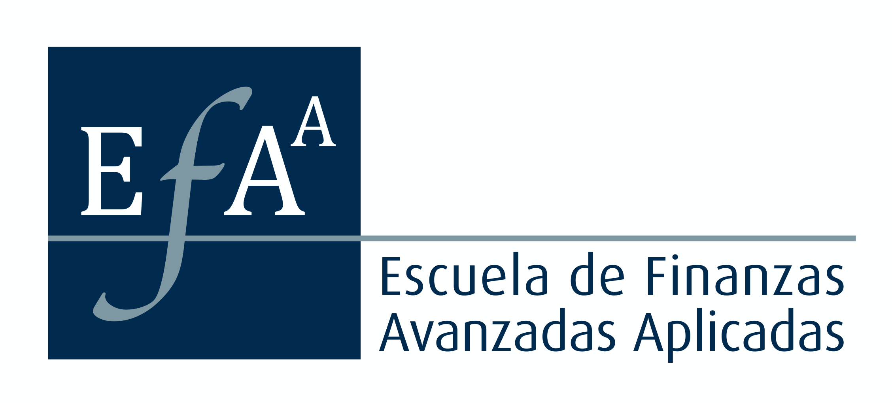

# Finanzas, Matemáticas y Programación

De todo un poco, videos de antiguas clases (quizás si de algunas nuevas si seguimos en cuarentena), código open source en VBA, Python y C++ para la valorización de instrumentos financieros y (próximamente) apuntes relacionados a conceptos matemáticos del diario vivir (del analista financiero).

## 2020-04-04
Alguna vez tuve [un canal en YouTube](https://www.youtube.com/channel/UCGwQ3AEA6KCc0ZS-yjmoDlA?view_as=subscriber), pero lo tenía botado y casi no había contenido. Desde hoy empiezo a dejar ahí todos los videos que alguna vez hice en la época en que hacía hartas clases a ejecutivos de banca. El contenido es "clásico", previo a la crisis del 2008-2009 y posteriores cambios estructurales en los mercados de derivados. Espero que todavía puedan ser de utilidad. En las descripciones de los mismos videos encontrarán links a las planillas Excel y presentaciones (en pdf).
