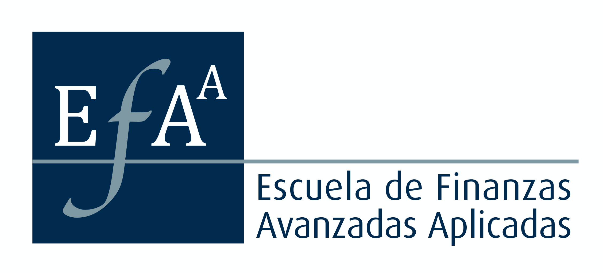

# About 

I am a mathematician, financial analyst, software engineer based in Chile. I work with Postgresql, C++ and Python and my expertise is in financial applications related to derivative products and market risk management.

I have trained many Chilean professionals working in the banking sector, mainly front office traders and market risk analysts.

I currently work at Banco Internacional (BI) as part of the dev team working on Treasury systems.

My focus nowadays is the C++/Python library `qcfinancial` which powers the analytics related to derivatives and market risk at BI. For those interested, documentation can be found at [Efaa Docs](https://qcfinancial.github.io)
